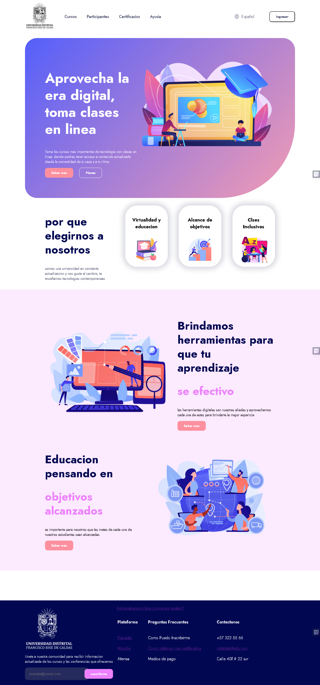

<h1>Taller 9 - Brigitte Bolaños </h1>
<h2>Informacion</h2>

curso Full Stack grupo 1

Docente: Cristian Patiño

<h2>Link de la pagina web</h2>
<a href="https://bimaga07.github.io/taller-9-full-stack/"> Link de pagina
<h2>punto 1 Link de figma</h2>
<a href="https://www.figma.com/file/RFOGe141dhqXsVXvJ5Kjs4/Brigitte-Bola%C3%B1os?type=design&node-id=0%3A1&mode=design&t=J8MyymrqutjafhMK-1"> Link de figma </a>
<h2>punto 2 Diseño HTML</h2>

<h2>punto 3 Diseño con CSS</h2>

<h2>punto 4 Titulos </h2>

<h2>punto 5 Parrafo</h2>

<h2>punto 6 Links</h2>

<h2>punto 7 y 8 Navegacion </h2>

<h2>punto 9 Tabla</h2>